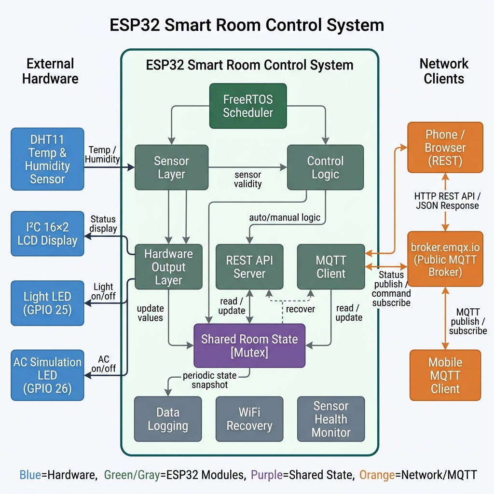
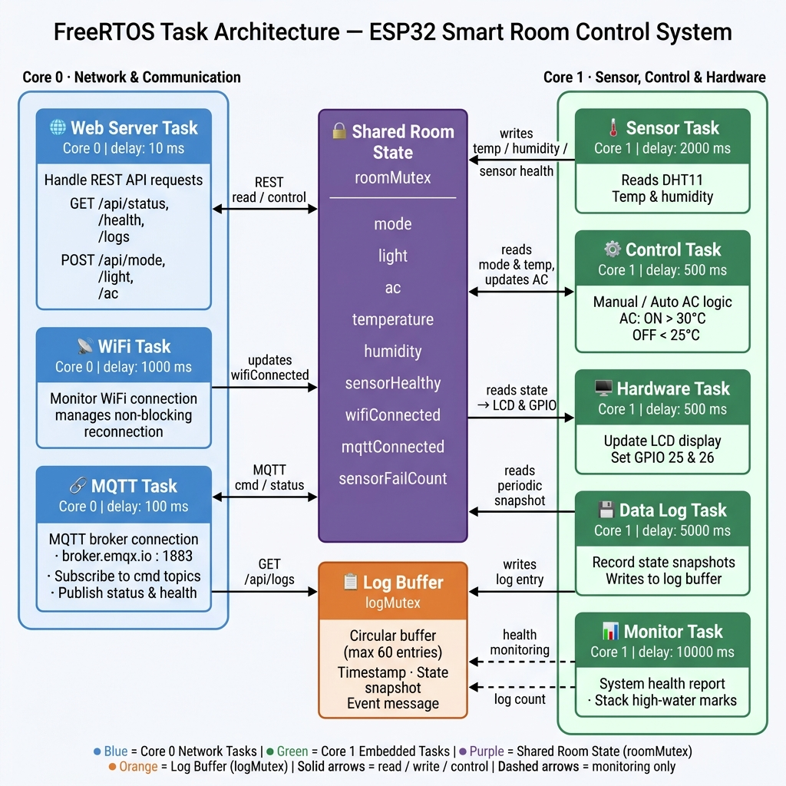

# ESP32 Smart Room Control System

An ESP32-based smart room control system built with FreeRTOS, REST API, data logging, WiFi recovery, and MQTT remote control.

This project simulates a small IoT room automation system. It monitors temperature and humidity using a DHT11 sensor, displays real-time status on an I2C LCD, controls simulated light and AC outputs through GPIO, provides REST API endpoints for local network control, and supports MQTT-based remote control through a public broker.

---

## Project Overview

The goal of this project is to build a more realistic embedded IoT system instead of a simple single-loop Arduino program.

The system is designed around multiple concurrent tasks, shared-state protection, network recovery, sensor health monitoring, local REST API access, data logging, and MQTT-based bidirectional communication.

The final system runs on an ESP32 and uses FreeRTOS task scheduling to separate sensor reading, control logic, hardware rendering, web server handling, WiFi management, data logging, system monitoring, and MQTT communication.

---
[Watch the demo video on YouTube](https://youtube.com/shorts/NA25kLLLWEM?si=l9GkfOoP3N4IEaXU)

## Features

- ESP32-based embedded IoT control system
- FreeRTOS multi-task architecture
- DHT11 temperature and humidity monitoring
- I2C LCD real-time status display
- GPIO-based light and AC simulation
- Manual and automatic control modes
- REST API for local network monitoring and control
- MQTT remote monitoring and control
- Periodic data logging using a circular buffer
- WiFi offline recovery
- Sensor health monitoring
- System health endpoint with FreeRTOS stack information
- Mobile MQTT client control support

---

## Hardware Components

| Component | Purpose |
|---|---|
| ESP32 Dev Board | Main microcontroller and WiFi-enabled control unit |
| DHT11 Sensor | Temperature and humidity sensing |
| I2C 16x2 LCD | Real-time system status display |
| LED on GPIO25 | Simulated room light output |
| LED on GPIO26 | Simulated AC output |
| Jumper Wires | Circuit connection |
| Breadboard | Prototyping |

No relay or servo motor is used in the current version.  
The AC is simulated using an LED output.

---

## Wiring

| ESP32 Pin | Connected Component | Description |
|---|---|---|
| GPIO4 | DHT11 Data | Temperature and humidity input |
| GPIO21 | LCD SDA | I2C data line |
| GPIO22 | LCD SCL | I2C clock line |
| GPIO25 | LED | Simulated light output |
| GPIO26 | LED | Simulated AC output |
| 3.3V / 5V | Sensors / LCD | Power supply depending on module requirement |
| GND | All components | Common ground |

---

## System Architecture

The system is divided into several functional layers:

1. **Sensor Layer**  
   Reads temperature and humidity data from the DHT11 sensor.

2. **Control Layer**  
   Handles manual mode and automatic AC control based on temperature thresholds.

3. **Hardware Layer**  
   Updates GPIO outputs and LCD display.

4. **REST API Layer**  
   Provides local network endpoints for status checking and device control.

5. **MQTT Layer**  
   Publishes system status and receives remote control commands.

6. **Logging Layer**  
   Stores recent system events and sensor data in a circular buffer.

7. **Recovery Layer**  
   Monitors WiFi connection and attempts automatic reconnection.

---

## FreeRTOS Task Design

The system uses multiple FreeRTOS tasks to separate responsibilities and improve maintainability.

| Task | Core | Responsibility |
|---|---:|---|
| Sensor Task | Core 1 | Reads DHT11 temperature and humidity data |
| Control Task | Core 1 | Applies automatic control logic |
| Hardware Task | Core 1 | Updates GPIO outputs and LCD display |
| Web Server Task | Core 0 | Handles REST API requests |
| WiFi Task | Core 0 | Monitors and recovers WiFi connection |
| MQTT Task | Core 0 | Maintains MQTT connection and handles messages |
| Data Log Task | Core 1 | Periodically records system status |
| Monitor Task | Core 1 | Prints system health and task stack information |

A mutex is used to protect shared room state, including mode, light status, AC status, temperature, humidity, sensor health, WiFi status, and MQTT status.

---

## Control Modes

The system supports two operation modes:

### Manual Mode

In manual mode, the user can directly control the light and AC outputs through REST API or MQTT commands.

### Auto Mode

In auto mode, the AC output is controlled automatically based on temperature:

```cpp
#define AC_ON_TEMP 30
#define AC_OFF_TEMP 25
```

Control behavior:

- If temperature is above 30°C, AC turns on.
- If temperature is below 25°C, AC turns off.
- Between 25°C and 30°C, the previous AC state is kept to avoid frequent switching.

---

## REST API

The ESP32 hosts a local web server on port 80. Once connected to WiFi, the device can be accessed using its local IP address.

Example:

```text
http://<ESP32_IP>/api/status
```

### API Endpoints

| Method | Endpoint | Description |
|---|---|---|
| GET | `/api/status` | Returns current room status and system health |
| GET | `/api/health` | Returns detailed system health information |
| GET | `/api/logs` | Returns stored data logs |
| POST | `/api/logs/clear` | Clears the data log buffer |
| POST | `/api/mode?value=AUTO` | Switches to auto mode |
| POST | `/api/mode?value=MANUAL` | Switches to manual mode |
| POST | `/api/light?value=1` | Turns light on |
| POST | `/api/light?value=0` | Turns light off |
| POST | `/api/light?value=toggle` | Toggles light state |
| POST | `/api/ac?value=1` | Turns AC output on |
| POST | `/api/ac?value=0` | Turns AC output off |
| POST | `/api/ac?value=toggle` | Toggles AC output |
| POST | `/api/control?light=1&ac=0` | Controls light and AC together |

### Example `/api/status` Response

```json
{
  "ok": true,
  "room": {
    "mode": "MANUAL",
    "light": 0,
    "ac": 0,
    "temperature": 28,
    "humidity": 70
  },
  "health": {
    "sensorHealthy": true,
    "wifiConnected": true,
    "mqttConnected": true,
    "sensorFailCount": 0
  }
}
```

---

## MQTT Communication

The system supports bidirectional MQTT communication.

The ESP32 publishes real-time room status and health information to MQTT topics. It also subscribes to command topics so that a mobile MQTT client can remotely control the device.

### MQTT Broker

```cpp
#define MQTT_BROKER "broker.emqx.io"
#define MQTT_PORT 1883
```

### MQTT Publish Topics

| Topic | Description |
|---|---|
| `linballball/smartroom/esp32-smart-room-01/status` | Publishes room status |
| `linballball/smartroom/esp32-smart-room-01/health` | Publishes system health |
| `linballball/smartroom/esp32-smart-room-01/log` | Publishes MQTT-related logs |
| `linballball/smartroom/esp32-smart-room-01/availability` | Publishes device online/offline status |

### MQTT Subscribe Topics

| Topic | Payload Example | Description |
|---|---|---|
| `linballball/smartroom/esp32-smart-room-01/cmd/mode` | `AUTO` or `MANUAL` | Changes operation mode |
| `linballball/smartroom/esp32-smart-room-01/cmd/light` | `1`, `0`, or `toggle` | Controls light output |
| `linballball/smartroom/esp32-smart-room-01/cmd/ac` | `1`, `0`, or `toggle` | Controls AC output |
| `linballball/smartroom/esp32-smart-room-01/cmd/control` | `{"light":1,"ac":0}` | Controls multiple outputs |

### MQTT Test Result

A mobile MQTT client was used to connect to `broker.emqx.io`. After subscribing to the status topic, the client successfully received real-time JSON status messages from the ESP32.

The mobile client was also used to publish commands to the light, AC, and mode command topics. The ESP32 received the MQTT commands and updated the GPIO outputs successfully.

This confirms end-to-end MQTT communication:

```text
Mobile MQTT Client
→ Public MQTT Broker
→ ESP32 MQTT Client
→ GPIO Output Control
```

---

## Data Logging

The system includes a circular buffer for data logging.

```cpp
#define LOG_BUFFER_SIZE 60
#define LOG_INTERVAL_MS 5000
```

The log system records:

- Timestamp
- Log type
- Current mode
- Light state
- AC state
- Temperature
- Humidity
- Sensor health
- WiFi status
- MQTT status
- Sensor failure count
- Event message

The logs can be accessed through:

```text
GET /api/logs
```

The buffer stores the latest 60 log entries. When the buffer is full, new entries overwrite the oldest entries.

---

## WiFi Recovery

The system includes non-blocking WiFi recovery.

If the ESP32 loses WiFi connection, the WiFi task detects the disconnection and periodically attempts to reconnect without stopping the rest of the system.

```cpp
#define WIFI_RETRY_INTERVAL 5000
#define WIFI_CONNECT_TIMEOUT 8000
```

During WiFi disconnection:

- The hardware control logic continues running.
- The LCD shows WiFi error status.
- MQTT is marked as disconnected.
- The system keeps trying to reconnect.

---

## Sensor Health Monitoring

The system tracks DHT11 read failures.

```cpp
#define SENSOR_FAIL_LIMIT 5
```

If the sensor fails repeatedly, the system marks the sensor as unhealthy. This prevents automatic control logic from relying on invalid sensor data.

When valid sensor readings return, the sensor health status is restored.

---

## LCD Display

The LCD displays real-time system information:

```text
T:28 H:70 A:OF M
L:ON W:OK M:OK
```

Meaning:

| Display | Meaning |
|---|---|
| `T` | Temperature |
| `H` | Humidity |
| `A` | AC state |
| `L` | Light state |
| `W` | WiFi status |
| `M` on first line | Manual / Auto mode |
| `M` on second line | MQTT status |

---

## How to Run

### 1. Install Required Arduino Libraries

Install the following libraries in Arduino IDE:

- `LiquidCrystal_I2C`
- `DHT sensor library`
- `ArduinoJson`
- `PubSubClient`

### 2. Select Board

In Arduino IDE, select:

```text
ESP32 Dev Module
```

### 3. Update WiFi Credentials

Update the WiFi name and password in the code:

```cpp
const char* ssid = "YOUR_WIFI_NAME";
const char* password = "YOUR_WIFI_PASSWORD";
```

### 4. Confirm MQTT Broker Setting

Make sure the MQTT broker is set to:

```cpp
#define MQTT_BROKER "broker.emqx.io"
#define MQTT_PORT 1883
```

### 5. Upload the Program

Upload the program to the ESP32 using Arduino IDE.

### 6. Open Serial Monitor

Open Serial Monitor at:

```text
115200 baud
```

### 7. Check ESP32 IP Address

Check the ESP32 IP address from the Serial Monitor or the LCD.

### 8. Test REST API

Open the following URL in a browser:

```text
http://<ESP32_IP>/api/status
```

### 9. Test MQTT Status Subscribe

Use a mobile MQTT client to connect to:

```text
broker.emqx.io
```

Then subscribe to:

```text
linballball/smartroom/esp32-smart-room-01/status
```

### 10. Test MQTT Remote Control

Publish a command to test remote control:

```text
Topic:
linballball/smartroom/esp32-smart-room-01/cmd/light

Payload:
toggle
```

If successful, the LED connected to GPIO25 should toggle.

---

## Testing Results

| Test Item | Result |
|---|---|
| ESP32 boot | Passed |
| WiFi connection | Passed |
| LCD display | Passed |
| DHT11 sensor reading | Passed |
| REST API `/api/status` | Passed |
| REST API `/api/health` | Passed |
| REST API `/api/logs` | Passed |
| Manual light control | Passed |
| Manual AC simulation control | Passed |
| Auto mode control logic | Passed |
| Data logging | Passed |
| WiFi recovery | Passed |
| MQTT broker connection | Passed |
| MQTT status publish | Passed |
| MQTT command receive | Passed |
| Mobile MQTT light control | Passed |
| Mobile MQTT AC control | Passed |
| Mobile MQTT mode control | Passed |

---

## Demo Checklist

A recommended demo video can include the following steps:

1. Show the ESP32, LCD, DHT11 sensor, and LEDs.
2. Show the LCD displaying temperature, humidity, WiFi status, MQTT status, and mode.
3. Open `/api/status` in a browser and show the JSON response.
4. Open `/api/health` and show system health information.
5. Open `/api/logs` and show recorded logs.
6. Open a mobile MQTT client and subscribe to the status topic.
7. Show real-time MQTT status messages.
8. Publish a `cmd/light` command and show the LED changing state.
9. Publish a `cmd/ac` command and show the AC simulation LED changing state.
10. Publish a `cmd/mode` command and show the mode changing between `AUTO` and `MANUAL`.

---

## Project Evolution

This project started as a basic Arduino room control system and was later migrated to ESP32 to support WiFi connectivity and IoT features.

The final version expands the original control logic into a more complete embedded IoT system with FreeRTOS task scheduling, REST API access, data logging, WiFi recovery, sensor health monitoring, and MQTT-based remote control.

---

## Future Improvements

Possible future improvements include:

- Add real relay control for actual AC or fan switching
- Add persistent storage using SPIFFS or SD card
- Add authentication for REST API endpoints
- Add MQTT username/password authentication
- Add TLS support for secure MQTT communication
- Add a web dashboard with charts
- Add real-time clock module for accurate timestamps
- Add OTA firmware update support
- Replace DHT11 with a more accurate sensor such as DHT22 or SHT31

---

## Conclusion

This project demonstrates an ESP32-based embedded IoT system with real-time sensing, multi-task scheduling, local REST API control, data logging, WiFi recovery, and MQTT remote control.

The system successfully supports both local and remote control paths, and the final test confirmed that a mobile MQTT client can send commands through a public MQTT broker to control ESP32 GPIO outputs in real time.
